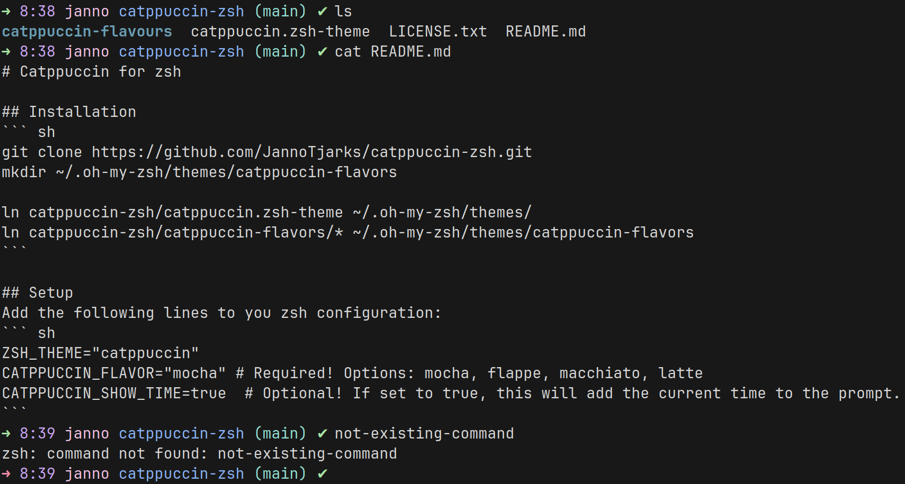

# Catppuccin for zsh

## Screenshot


## Installation
``` sh
git clone https://github.com/JannoTjarks/catppuccin-zsh.git
mkdir ~/.oh-my-zsh/themes/catppuccin-flavors

ln catppuccin-zsh/catppuccin.zsh-theme ~/.oh-my-zsh/themes/
ln catppuccin-zsh/catppuccin-flavors/* ~/.oh-my-zsh/themes/catppuccin-flavors
```

## Setup
Add the following lines to you zsh configuration:
``` sh
ZSH_THEME="catppuccin"
CATPPUCCIN_FLAVOR="mocha" # Required! Options: mocha, flappe, macchiato, latte
CATPPUCCIN_SHOW_TIME=true  # Optional! If set to true, this will add the current time to the prompt.
```
